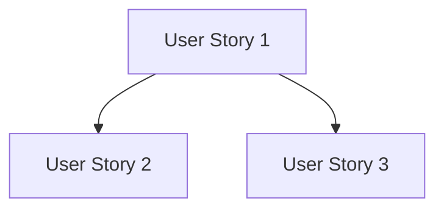

# Tasks Workflow

This workflow generates an actionable, dependency-ordered task list from the implementation plan.

## Purpose

Break down the implementation plan into executable tasks that:
- Are organized by user story for independent testing
- Have clear dependencies and parallel execution markers
- Include specific file paths
- Can be immediately executed by an AI agent

## When to Use

- Implementation plan is complete
- Ready to start implementation
- Need a clear task breakdown

## Prerequisites

- **Required**: `design.md` (tech stack, libraries, structure)
- **Required**: `requirements.md` (user stories with priorities)
- **Optional**: `data-model.md` (entities)
- **Optional**: `contracts/` (API endpoints)
- **Optional**: `research.md` (decisions)
- **Optional**: `quickstart.md` (test scenarios)

## Execution Flow

### Step 1: Load Design Documents

Read from feature directory (`.kiro/specs/[###-feature-name]/`):
1. `design.md` - Extract tech stack, libraries, project structure
2. `requirements.md` - Extract user stories with priorities (P1, P2, P3)
3. If exists: `data-model.md` - Extract entities
4. If exists: `contracts/` - Map endpoints
5. If exists: `research.md` - Extract setup decisions

### Step 2: Map Requirements to Tasks

**From User Stories (PRIMARY ORGANIZATION)**:
- Each user story (P1, P2, P3) gets its own phase
- Map related components to their story:
  - Models needed for that story
  - Services needed for that story
  - Endpoints/UI needed for that story
  - Tests specific to that story

**From Contracts**:
- Map each endpoint to the user story it serves
- Contract tests before implementation (if requested)

**From Data Model**:
- Map each entity to user story(ies) that need it
- If entity serves multiple stories: put in earliest or Setup phase

**From Infrastructure**:
- Shared infrastructure -> Setup phase
- Story-specific setup -> within that story's phase

### Step 3: Generate Task List

Use `templates/tasks-template.md` as reference for the output format.

#### Task Format (REQUIRED)

Every task MUST follow this format:
```
- [ ] [TaskID] [P?] [Story?] Description with file path
```

**Format Components**:
1. **Checkbox**: ALWAYS start with `- [ ]`
2. **Task ID**: Sequential (T001, T002, T003...)
3. **[P] marker**: ONLY if task is parallelizable
4. **[Story] label**: REQUIRED for user story phases (US1, US2, etc.)
5. **Description**: Clear action with exact file path

**Examples**:
```markdown
- [ ] T001 Create project structure per implementation plan
- [ ] T005 [P] Implement authentication middleware in src/middleware/auth.py
- [ ] T012 [P] [US1] Create User model in src/models/user.py
- [ ] T014 [US1] Implement UserService in src/services/user_service.py
```

**WRONG** (don't do this):
```markdown
- [ ] Create User model  # Missing ID and Story label
T001 [US1] Create model  # Missing checkbox
- [ ] [US1] Create User model  # Missing Task ID
- [ ] T001 [US1] Create model  # Missing file path
```

### Step 4: Organize by Phase

```markdown
# Tasks: [FEATURE NAME]

## Phase 1: Setup
[Project initialization tasks]

- [ ] T001 Create project directory structure
- [ ] T002 [P] Initialize package.json with dependencies
- [ ] T003 [P] Create configuration files

## Phase 2: Foundational
[Blocking prerequisites for all user stories]

- [ ] T004 Create database schema
- [ ] T005 [P] Implement base model classes

## Phase 3: User Story 1 - [Title] (P1)

**Goal**: [Story goal from spec]
**Independent Test**: [How to test this story alone]

- [ ] T006 [US1] Create Entity model in src/models/entity.py
- [ ] T007 [US1] Implement EntityService in src/services/entity_service.py
- [ ] T008 [US1] Create API endpoint in src/api/entity.py

## Phase 4: User Story 2 - [Title] (P2)

**Goal**: [Story goal]
**Independent Test**: [How to test]

- [ ] T009 [US2] ...
- [ ] T010 [US2] ...

## Phase N: Polish & Cross-Cutting

- [ ] T0XX Add logging throughout application
- [ ] T0XX Update documentation

## Dependencies



## Parallel Execution

### Within Phase 3 (US1)
T006, T007 can run in parallel (different files)
T008 depends on T006, T007

## Implementation Strategy

- **MVP Scope**: Complete Phase 3 (User Story 1) for minimum viable product
- **Incremental Delivery**: Each user story phase is independently testable
```

### Step 5: Validate Tasks

**Checklist Format Validation**:
- [ ] ALL tasks start with `- [ ]`
- [ ] ALL tasks have Task ID (T001, T002...)
- [ ] User Story phase tasks have [USx] label
- [ ] ALL tasks have file paths where applicable
- [ ] [P] markers only on parallelizable tasks

**Coverage Validation**:
- [ ] Each user story has all needed tasks
- [ ] Each story is independently testable
- [ ] Dependencies are clear
- [ ] No orphan tasks (tasks without requirement source)

### Step 6: Report Completion

```markdown
## Tasks Generated

**Output**: [path to tasks.md]

### Summary
- Total tasks: [N]
- Setup phase: [N] tasks
- Foundational phase: [N] tasks
- User Story phases: [N] stories, [N] tasks each
- Polish phase: [N] tasks

### Parallel Opportunities
[N] tasks marked for parallel execution

### MVP Scope
User Story 1 (Phase 3) provides minimum viable product

### Format Validation
All tasks follow checklist format: PASS/FAIL
```

## Tests Are Optional

Test tasks should ONLY be generated if:
- Explicitly requested in feature specification
- User requests TDD approach
- Steering (tech.md) mandates test-first

If tests are included, order within each story phase:
1. Tests (contract -> integration -> e2e -> unit)
2. Models
3. Services
4. Endpoints
5. Integration

## Output

After completing this workflow:
- `tasks.md` - Complete task list organized by user story

## Next Steps

Suggest to the user:
```
Tasks generated at .kiro/specs/[###-feature-name]/tasks.md

Next, you can:
1. Run **Analyze** to validate consistency across spec/plan/tasks
2. Run **Implement** to start execution
3. Review tasks before proceeding
```
